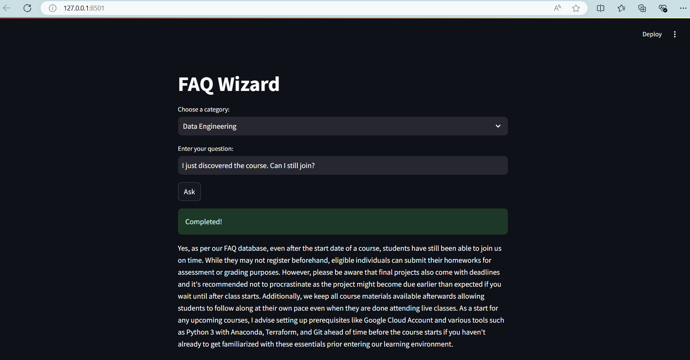

# FAQ Wizzard

The FAQ Wizard is an interactive application that helps users quickly find answers to questions related to various Data zoomcamp courses. Utilizing Elasticsearch for efficient data retrieval and the phi3 language model via Ollama, this app delivers accurate and context-aware responses while running seamlessly on CPU.

### Key Features:
- Course-Specific Queries: Select from various course categories for tailored answers.
- Advanced Search Capabilities: Leverages Elasticsearch to search FAQs, prioritizing the most relevant results.
- AI-Powered Responses: Utilizes the phi3 model from Ollama to generate natural language answers based on the retrieved context, enhancing the user experience without the need for a GPU.




## Usage

1. Clone the repository:

   ```
   git clone https://github.com/zstankow/ollama-FAQ-assistant.git
   ```

2. Install the requirements:
    ```
    pip install -r requirements.txt
    ```

3. Start the docker container:

    ```
    cd ollama-FAQ-assistant
    docker-compose up
    ```

4. Open a separate terminal and access the Docker container:

    ```
    cd ollama-FAQ-assistant
    docker exec -it ollama bash
    ```
    Then pull the required model:

    ```
    ollama pull phi3
    ```

5. Index the documents:
    ```
    python index_documents.py
    ```

6. Run the streamlit app:
    ```
    streamlit run app.py
    ```

